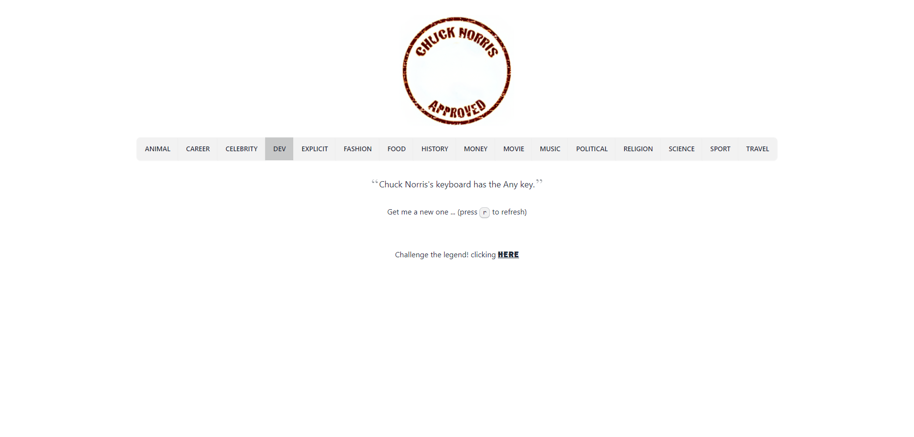
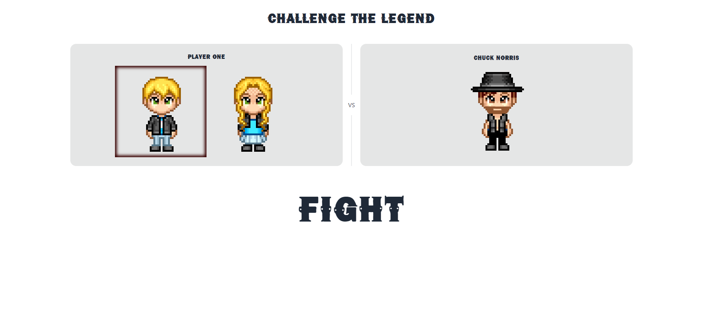
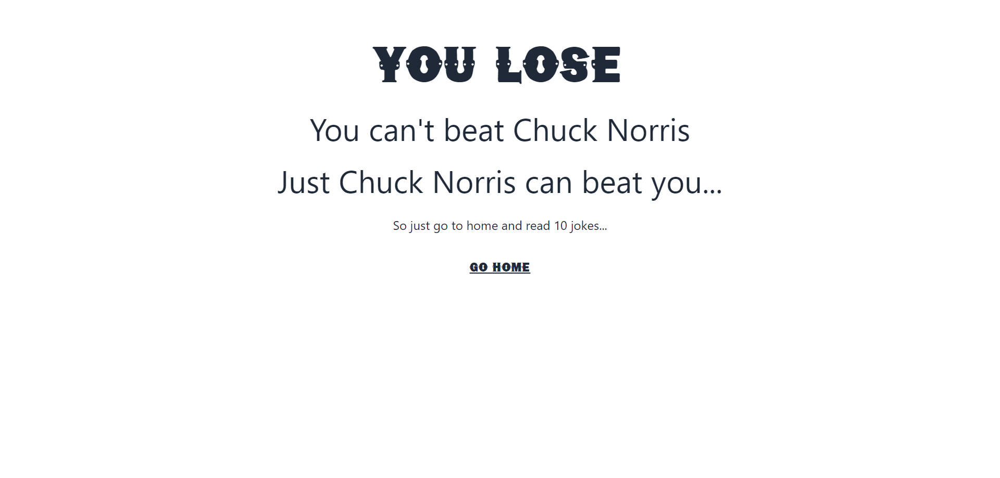
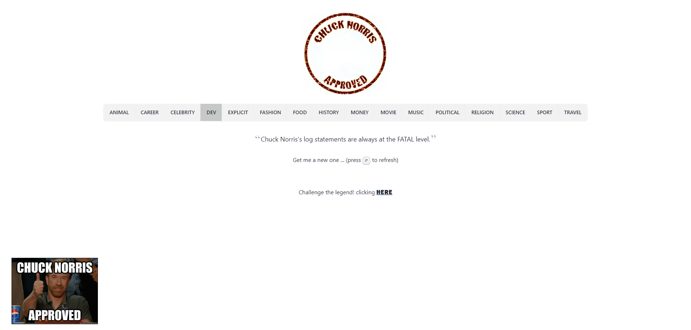

<!-- markdownlint-disable -->
<div align="center" style="margin-top: 24px">
  
  <h3 align="center">A client application to train SolidJS, Vite, TailwindCSS and DaisyUI.</h3>
</div>
<!-- markdownlint-disable -->

## MOTIVATIONS

Looking at the state of javascript website, the framework with the most interest and retention is Solid, this caught my attention in creating a small POC to learn.

## LAYOUT

### Home



### Select fighter



### Challenge result



### Home Chuck Norris Approved



## GETTING STARTED

1. First time

   ```shell
   git clone git@github.com:allanfoppa/chuck-norris-approved.git
   ```

   ```shell
   npm install
   ```

2. Then run a command

   ```shell
   npm run dev
   ```

## Thank you

Thanks to these web tools that helped me with all the resources for this small study project! Saved me a lot of effort.

- [Chuck Norris API](https://api.chucknorris.io/)
- [Avatar in pixels](https://www.avatarsinpixels.com/)
- [Dafont](https://www.dafont.com/)

## Contributing

Any contributions you make are **greatly appreciated**.
