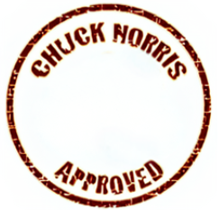

<!-- markdownlint-disable -->
<div align="center" style="margin-top: 24px">
  
  <h3 align="center">A client application to train SolidJS, Vite, TailwindCSS and DaisyUI.</h3>
</div>
<!-- markdownlint-disable -->

## MOTIVATIONS

Looking at the state of javascript website, the framework with the most interest and retention is Solid, this caught my attention in creating a small POC to learn.

## LAYOUT

### Home


### Select fighter


### Challenge result


### Home Chuck Norris Approved


## GETTING STARTED

1. First time

   ```shell
   git clone git@github.com:allanfoppa/chuck-norris-approved.git
   ```

   ```shell
   npm install
   ```

2. Then run a command

   ```shell
   npm run dev
   ```

## THANK YOU

Thanks to these web tools that helped me with all the resources for this small study project! Saved me a lot of effort.

- [Chuck Norris API](https://api.chucknorris.io/)
- [Avatar in pixels](https://www.avatarsinpixels.com/)
- [Dafont](https://www.dafont.com/)

## FINAL CONSIDERATIONS

This application is a practice project built to explore technologies and concepts. It's not intended for commercial use and may not adhere to best practices for production environments.
Feel free to explore, contribute, or provide feedback. Thank you for checking it out!
